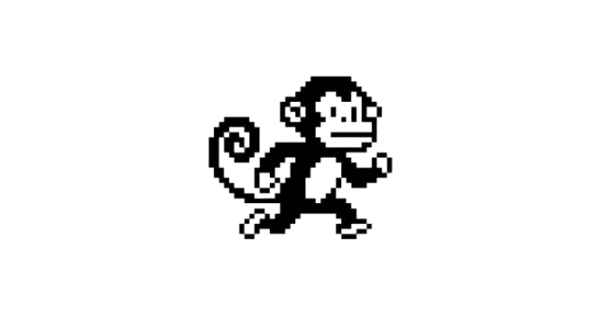

# Monkey Jump Game 🐒

A fun and addictive browser-based game inspired by Google Chrome's dinosaur game, but with a monkey as the main character and hippos as obstacles! Help the monkey jump over hippos and achieve the highest score possible.



## 🎮 Play Now

You can play the game directly in your browser by opening the `index.html` file or by hosting it on a web server.

## 🚀 How to Run

1. Clone this repository:
   ```bash
   git clone https://github.com/yourusername/monkey-jump.git
   ```

2. Navigate to the project folder:
   ```bash
   cd monkey-jump
   ```

3. Open `index.html` in your web browser:
   ```bash
   # Just double-click the file or use:
   open index.html  # On macOS
   start index.html # On Windows
   xdg-open index.html # On Linux
   ```

## 🎯 How to Play

- **Objective**: Control the monkey and jump over incoming hippos.
- **Controls**:
  - Press `SPACE`, `UP ARROW`, or `CLICK` to make the monkey jump
  - Press `P` to pause/resume the game
  - Press `R` to restart when game is over
- **Scoring**:
  - Each hippo dodged gives you 1 point
  - Game speed increases every 10 points
  - Try to beat your high score!

## ✨ Features

- 🐒 **Cute monkey character** with smooth jumping physics
- 🦛 **Randomly generated hippo obstacles** at different heights
- 📊 **Score tracking** with local storage for high scores
- ⚡ **Progressive difficulty** - game speeds up as you score more points
- 🎨 **Beautiful UI** with retro gaming aesthetic
- 🎮 **Multiple control options** (keyboard, mouse, touch)
- ⏸️ **Pause/resume functionality**
- 📱 **Responsive design** that works on desktop and mobile
- ☁️ **Animated background** with moving clouds

## 🛠️ Technologies Used

- **HTML5** for structure
- **CSS3** for styling with Flexbox and animations
- **JavaScript (ES6)** for game logic
- **HTML5 Canvas** for rendering game graphics
- **Local Storage** for saving high scores
- **Font Awesome** for icons
- **Google Fonts** for typography

## 📁 Project Structure

```
monkey-jump/
├── index.html          # Main HTML file
├── README.md           # This file
├── LICENSE             # MIT License
├── .gitignore          # Git ignore file
├── images/             # Game assets
│   ├── monkey.png      # Monkey character
│   └── hippo.png       # Hippo obstacle
├── css/                # Stylesheets
│   └── style.css       # Main styles
└── js/                 # JavaScript files
    └── game.js         # Game logic
```

## 🎨 Game Design Details

### Game Mechanics
- **Gravity Physics**: Realistic jumping with gravity simulation
- **Collision Detection**: Rectangle-based collision between monkey and hippos
- **Progressive Difficulty**: Speed increases with score to keep the game challenging
- **Randomization**: Hippos spawn at random heights and intervals

### Visual Elements
- **Sky Background**: Animated clouds that move across the screen
- **Ground Layer**: Brown ground with green grass on top
- **Character Sprites**: Custom monkey and hippo images
- **UI Elements**: Retro-style score display and control buttons

## 🔧 Customization

Want to customize the game? Here are some easy modifications:

### Change Game Difficulty
Edit `js/game.js`:
```javascript
// Adjust these values:
let gameSpeed = 5; // Base speed
let hippoSpawnRate = 100; // Frames between hippo spawns
let speed = 1.0 + Math.floor(score / 10) * 0.2; // Speed increase rate
```

### Replace Images
Simply replace the files in the `images/` folder:
- `monkey.png` - Should be 1408x768 or similar aspect ratio
- `hippo.png` - Should be 1408x768 or similar aspect ratio

### Change Colors
Edit `css/style.css` to modify the color scheme:
```css
body {
    background: linear-gradient(135deg, #1a2980, #26d0ce); /* Background gradient */
}
```

## 🐛 Known Issues & Future Improvements

### Current Issues
- Collision detection uses simple rectangles (may not be pixel-perfect)
- No sound effects (placeholder button only)
- Limited animation frames for characters

### Planned Improvements
- [ ] Add sound effects and background music
- [ ] Implement pixel-perfect collision detection
- [ ] Add more obstacle types (birds, stones, etc.)
- [ ] Include power-ups (double jump, slow motion, etc.)
- [ ] Add monkey animations (running, jumping frames)
- [ ] Implement online leaderboard
- [ ] Create level progression system

## 🤝 Contributing

Contributions are welcome! If you have ideas for improvements or find bugs:

1. Fork the repository
2. Create a feature branch (`git checkout -b feature/AmazingFeature`)
3. Commit your changes (`git commit -m 'Add some AmazingFeature'`)
4. Push to the branch (`git push origin feature/AmazingFeature`)
5. Open a Pull Request

## 📄 License

This project is licensed under the MIT License - see the [LICENSE](LICENSE) file for details.

## 🙏 Acknowledgments

- Inspired by Google Chrome's dinosaur game
- Monkey and hippo images created for this project
- Thanks to all contributors and testers
- Built with ❤️ for the gaming community

## 📞 Contact & Support

If you have questions, suggestions, or just want to share your high score:

- Open an [issue](https://github.com/yourusername/monkey-jump/issues) on GitHub
- Share your feedback via pull requests

---

**Happy Jumping!** 🐒🦛✨

*Made with JavaScript and fun!*